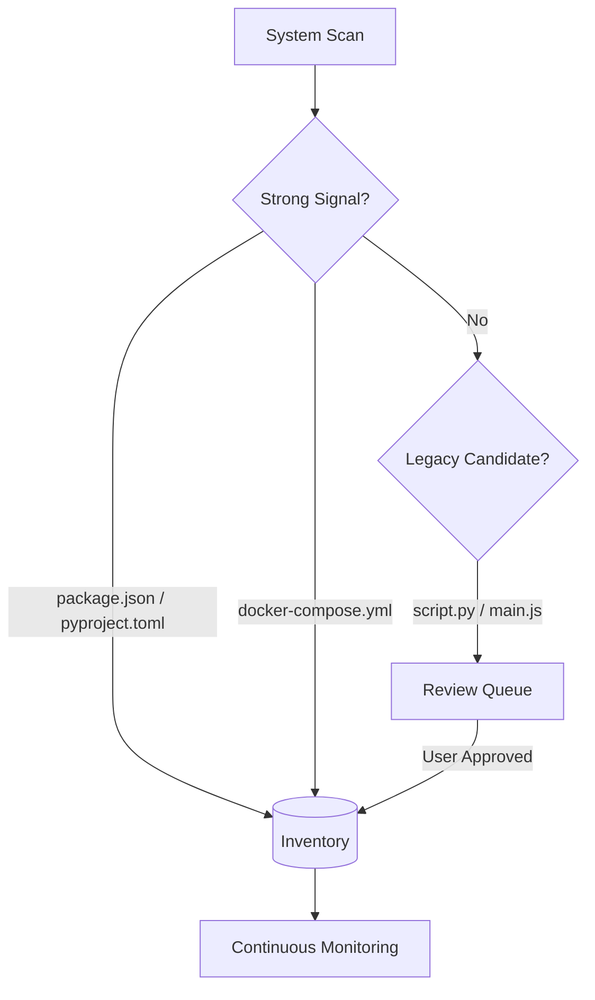

# Features & Capabilities: The Observer (mcp-server-manager)

**Unified Intelligence & Control for the Workforce Nexus.**

The Observer provides real-time visibility into the health and logs of your MCP ecosystem. This document provides a high-density reference for its discovery engine, monitoring protocols, and integrated maintenance actions.

---

## 📊 Feature Matrix

| Feature | Description | Lite Mode | Permanent Mode |
| :--- | :--- | :---: | :---: |
| **Auto-Discovery** | Scans filesystem for MCP servers | Glob-based | `pathspec` (Tiered) |
| **Health Monitoring** | Real-time process & Docker status | Basic (On-demand) | Continuous (Sync) |
| **Log Ingestion** | Unified log streaming console | Standard Output | Persistent Logs |
| **Maintenance GUI** | Interactive browser control panel | ✅ | ✅ |
| **Auto-Chmod** | (In Actions) Standardizes permissions | ✅ | ✅ |

---

## 📋 Table of Contents
1. [Discovery Architecture](#discovery-architecture)
2. [Command Matrix](#command-matrix)
3. [GUI Maintenance Actions](#gui-maintenance-actions)
4. [Health Check Indicators](#health-check-indicators)w

---

## 🔍 Discovery Architecture

The Observer classifies potential servers into a tiered priority queue.

---

## 💻 Command Matrix (Lookup)

| Mode | Command | Action | Key Flag |
| :--- | :--- | :--- | :--- |
| **Dashboard** | `python mcp_server_manager.py --gui` | Launch web interface | `--port 5001` |
| **Scan** | `python -m mcp_inventory.cli scan` | Deep filesystem sweep | `--path ~/Dev` |
| **Inventory**| `python mcp_server_manager.py --inventory`| JSON/YAML inventory list | `--format json` |
| **Health** | `python mcp_server_manager.py --check` | Run system-wide diagnostics| `--verbose` |
| **Logs** | `python mcp_server_manager.py --logs` | Tail server logs | `--name shesha` |

---

## 🛠 GUI Maintenance Actions

The Observer GUI is the central cockpit for Nexus maintenance:

*   **Open Terminal**: Spawns a new terminal session in the target server's home directory.
*   **Update Tool**: Triggers the Activator to pull latest code and reinstall dependencies.
*   **Permissions Hardening**: Automatically runs `chmod +x` on all entry points during an update.
*   **Restart Server**: Safely kills active server processes and restarts the bridge.

---

## 📊 Health Check Indicators (TTY)

| Metric | Pass | Warn | Fail |
| :--- | :---: | :---: | :---: |
| **Nexus DB** | Integrity OK | Vacuum Required | **Missing / Locked** |
| **Docker** | Daemon Online | No containers | **Daemon Offline** |
| **Permissions** | Write Access ✅ | Read-only | **Access Denied** |

---

> **Author**: l00p3rl00p / Workforce Nexus
> **Reference**: [NEXUS_TECHNICAL_SPEC.md](../repo-mcp-packager/NEXUS_TECHNICAL_SPEC.md)

## 🏢 The Nexus Convergence Model
The Observer supports three tiers of organizational binding:

| Feature | Lite (Loose Binding) | Standard (Close Binding) | Industrial (Managed App) |
| :--- | :--- | :--- | :--- |
| **Logic Area** | Repos remain in workspace | `~/.mcp-tools/suite` (Symlinks) | `~/.mcp-tools/app` (Managed) |
| **Environment** | OS-Default / Manual | Per-module venvs | Unified Hardened Venv |
| **Update Path** | Manual per repo | Live (via Symlinks) | On-Demand (`nexus-sync`) |

---

## 📚 Master Documentation
For the complete suite experience and detailed procedures, see:
👉 **[NEXUS_GUIDE.md](../repo-mcp-packager/NEXUS_GUIDE.md)**

---

> **Author**: l00p3rl00p / Workforce Nexus
> **Reference**: [ARCHITECTURE.md](./ARCHITECTURE.md) | [ENVIRONMENT.md](./ENVIRONMENT.md)

