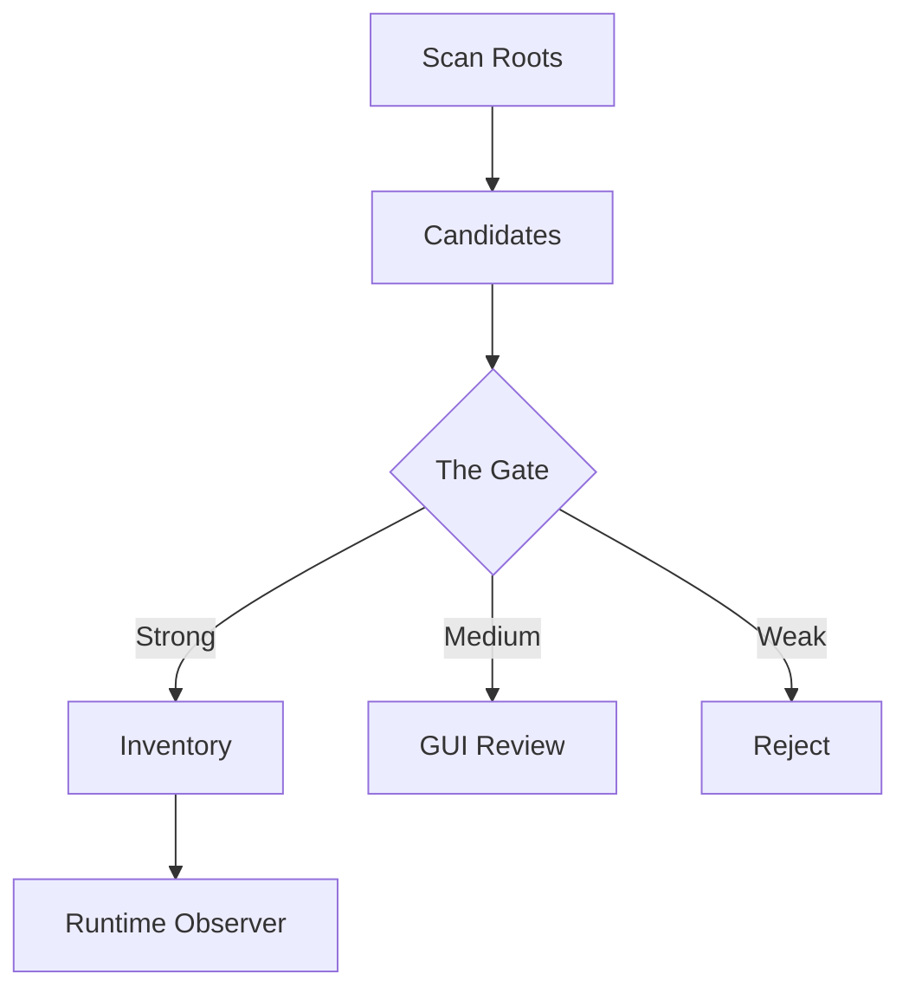

# MCP Workforce Nexus: The Observer (mcp-server-manager)

**Intelligent server discovery, inventory management, and runtime observability for the MCP ecosystem.**

The **Observer** scans your local workspace to identify MCP-capable repositories, applies a rigorous multi-signal acceptance gate, and maintains a centralized inventory of verified tools. It provides both a powerful CLI and a lightweight GUI for real-time monitoring.

---

## ⚡ Quick Start: Standalone Observer

Discover and list MCP servers in your current directory immediately:

```bash
python3 -m mcp_inventory scan .
python3 -m mcp_inventory list
```
*Selection tip: Use `scan` to find new candidates and `running` to check active heartbeats.*

---

## 🚀 Package Start: The Workforce Nexus

The Observer acts as the brain of the Workforce Nexus, monitoring servers injected by the Surgeon and discovered by the Librarian.

```bash
# Launch the Nexus Management GUI
./start_gui.sh
# OR
python3 -m mcp_inventory.cli gui
# Check Synergy Status:
python3 -m mcp_inventory check-synergy
```

---

## 📋 Table of Contents
1. [Observability Flow](#observability-flow)
2. [Reliability Gate Matrix](#reliability-gate-matrix)
3. [Core Capabilities](#core-capabilities)
4. [GUI & Runtime Lenses](#gui--runtime-lenses)
5. [Documentation (Low Density)](#documentation-low-density)

---

## 🔍 Observability Flow

The Observer follows a high-density logic path from raw file discovery to validated runtime status.



---

## 📊 Reliability Gate Matrix

The Observer identifies tools based on structural and contextual evidence.

| Signal Level | Markers | Action | Integration |
| :--- | :--- | :---: | :--- |
| **Strong** | `mcp.json`, SDK imports | **Auto-Add** | Indexed by Librarian |
| **Medium** | "MCP" mentions, agentic .env | **Review** | Flagged for GUI |
| **Weak** | Generic `.env`, standard DB | **Ignore** | Filtered Out |

---

## 🌟 Core Capabilities

*   **Intelligent Scanning**: Efficiently crawls workspaces while ignoring noise like `node_modules` or `.git`.
*   **Multi-Signal Gating**: Uses SDK detection, manifest parsing, and Docker metadata to categorize tools.
*   **Runtime Monitoring**: Tracks process heartbeats and Docker container health in real-time.
*   **Suite Synergy**: Exposes `inventory.yaml` for Librarian indexing, enabling unified knowledge queries.
*   **Unified CLI/GUI**: Operates seamlessly via terminal or a lightweight web-based interface.
*   **Nexus Integration**: Pulls configuration paths directly from the global Surgeon registry.


# Application Convergence & Synergy
The "Nexus Application" mode is triggered when the bootstrapper detects all four modules (mcp-injector, mcp-link-library, mcp-server-manager, repo-mcp-packager) in the same workspace.

Convergence Matrix (Organization & Areas)
Feature	Lite (Loose Binding)	Standard (Close Binding)	Industrial (Managed App)
Philosophy	"Distributed & Portable"	"Cohesive & Linked"	"Monolithic & Hardened"
Logic Area	Repos remain in workspace	~/.mcp-tools/suite (Symlinks)	~/.mcp-tools/app (Managed Mirror)
Shared Base	~/.mcp-tools/lite/	~/.mcp-tools/standard/	~/.mcp-tools/industrial/
Environment	OS-Default / Manual Venv	Per-module local venvs	Single Unified Hardened Venv
Update Path	Manual per repo	Live (via Symlinks)	On-Demand (nexus-sync)
Global Path	Optional (Local first)	Recommended	Mandatory Enforcement


---

## 👁️ GUI & Runtime Lenses

The Observer provides four distinct "lenses" for monitoring your workforce:
1.  **Application Health**: Versioning, state snapshots, and error severity.
2.  **Command Execution**: Timeline of arguments, outcomes, and stderr captures.
3.  **I/O Observability**: Tracking files and payloads passed between agents.
4.  **Inventory Management**: One-click activation/deactivation of verified servers.

---

## 🛠️ Nexus Command Reference (Observer Context)

| Tool | Shared Command | Direct Module Execution |
| :--- | :--- | :--- |
| **Observer** | `mcp-observer` | `python3 -m mcp_inventory.cli` |
| **Activator** | `mcp-activator` | `python3 bootstrap.py` |

---

## 🖥️ GUI Management (The Observer Dashboard)

*   **Launch Dashboard:** `mcp-observer gui`
*   **Stop:** `Ctrl + C` in the terminal.
*   **URL:** [http://localhost:8501](http://localhost:8501)

---

## 📚 Master Documentation
For the complete suite experience and detailed procedures, see:
👉 **[NEXUS_GUIDE.md](../repo-mcp-packager/NEXUS_GUIDE.md)**

---

## 📚 Documentation (Low Density Deep Dives)

Detailed technical manuals for engineering reference:

*   **[ARCHITECTURE.md](./ARCHITECTURE.md)**: Logic models, gate rules, and GUI-CLI contracts.
*   **[ENVIRONMENT.md](./ENVIRONMENT.md)**: Scan roots, filesystem impact, and OS discovery logic.
*   **[FEATURES.md](./FEATURES.md)**: Command matrix, scoring details, and scorable logs.

---

## 📝 Metadata
*   **Status**: Hardened (Phase 9)
*   **Author**: l00p3rl00p
*   **Workflow**: Adheres to `@/fix-md-files-for-release`
